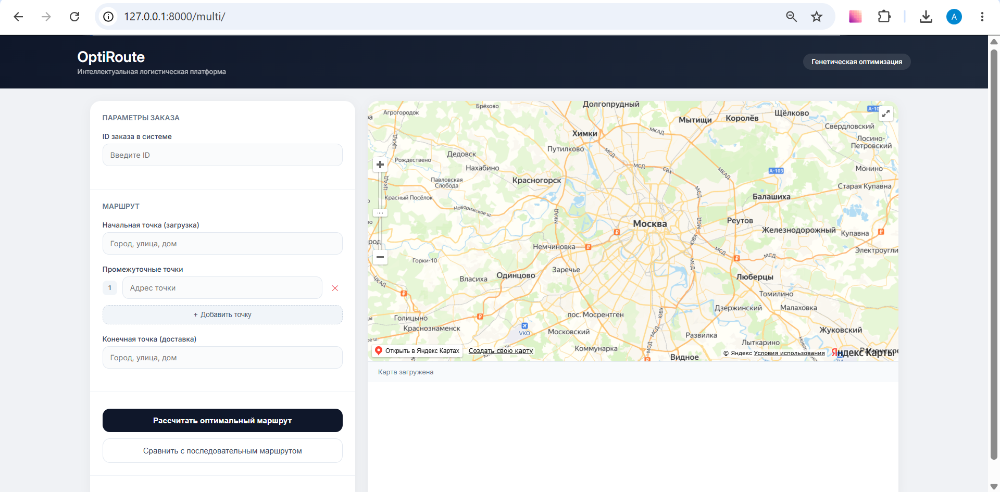
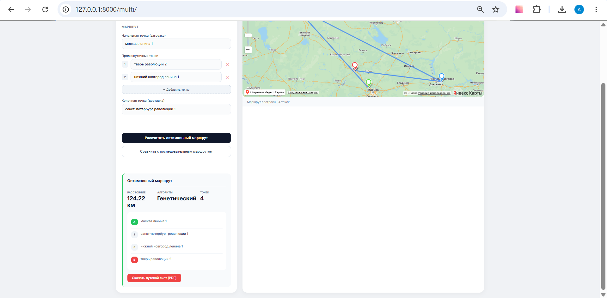
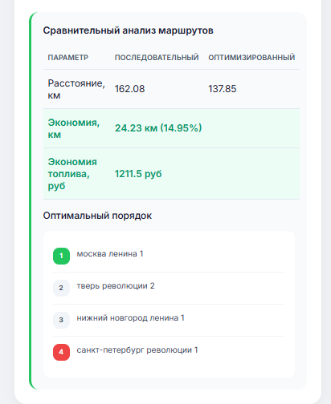
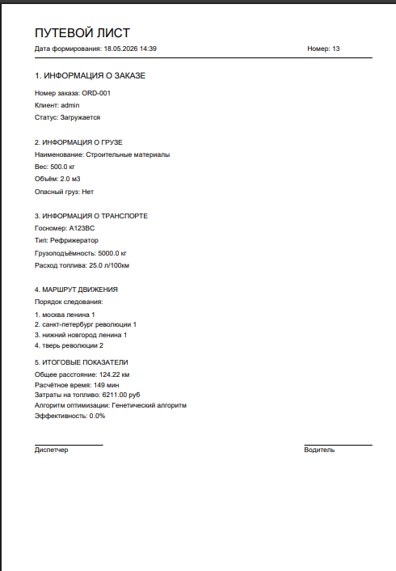
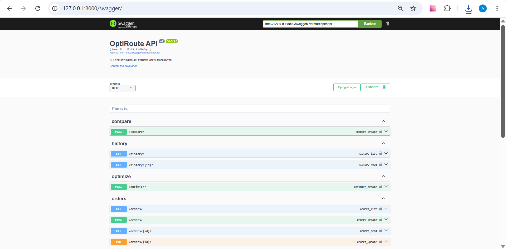

# OptiRoute

## О проекте

OptiRoute — это веб-приложение для оптимизации маршрутов доставки. Система помогает диспетчерам строить оптимальные маршруты для мультиточечных перевозок. Вместо ручного планирования используется генетический алгоритм, который находит самый короткий путь между точками.

Система умеет:

- рассчитывать оптимальный порядок объезда адресов;
- визуализировать маршрут на карте;
- сравнивать обычный и оптимизированный маршрут;
- генерировать путевой лист в PDF;
- предоставлять REST API с JWT-авторизацией;
- сохранять историю расчётов для аналитики.

## Как это работает

Диспетчер вводит адрес загрузки, промежуточные точки и адрес доставки. Генетический алгоритм перебирает возможные варианты порядка объезда и выбирает тот, который даёт наименьшее расстояние. Результат отображается на карте и сохраняется в базу данных.

Генетический алгоритм работает по принципу эволюции: создаётся множество случайных маршрутов, отбираются лучшие (с наименьшим расстоянием), они скрещиваются между собой и мутируют. Через несколько поколений получается маршрут, близкий к оптимальному. Для 5-10 точек расчёт занимает менее секунды.

## Скриншоты

_Главный экран: форма ввода адресов и карта_

_Результат оптимизации: расстояние и оптимальный порядок_

_Сравнение маршрутов: экономия в километрах и рублях_

_Путевой лист в формате PDF_

_Документация API через Swagger_

## Технологии

- Python 3.12
- Django 5.2
- Django REST Framework
- JWT авторизация
- Яндекс.Карты API
- ReportLab (PDF)
- Docker
- pytest

## Быстрый старт

**Локальный запуск:**
git clone https://github.com/nettbliss/logistics-ai.git  
cd logistics-ai  
python -m venv venv  
venv\Scripts\activate  
pip install -r requirements.txt  
python manage.py migrate  
python manage.py createsuperuser  
python manage.py runserver  
После запуска открой в браузере: http://127.0.0.1:8000/multi/

**Запуск через Docker:**

docker build -t optiroute .  
docker run -p 8000:8000 optiroute

## API

Эндпоинты доступны после получения JWT-токена.

# Получение токена:

POST /api/token/

# Оптимизация маршрута:

POST /api/optimize/  
{  
"order_id": 1,  
"pickup_address": "Москва, ул. Тверская, 1",  
"delivery_address": "Санкт-Петербург, Невский пр., 50",  
"waypoints": ["Тверь, ул. Революции, 12"]  
}

Полная документация доступна по адресу /swagger/

## Тесты

Тесты проходят автоматически при каждом пуше через GitHub Actions.

## Структура проекта

- core/ — модели заказов, грузов, транспорта
- routes/ — генетический алгоритм, API, логика
- accounts/ — пользователи и роли
- documents/ — генерация PDF
- logistics_system/ — настройки Django
- .github/workflows/ — CI/CD

## Текущие ограничения и планы развития

В демонстрационной версии маршрут отображается прямой линией, потому что построение точного маршрута по дорогам требует платного API Яндекс.Маршрутизации. Сам алгоритм оптимизации при этом работает корректно. Для перехода на реальные дороги достаточно заменить визуализацию — вызов платного API вернёт готовую линию маршрута с учётом пробок и правил дорожного движения. Это изменение запланировано на следующую версию.
